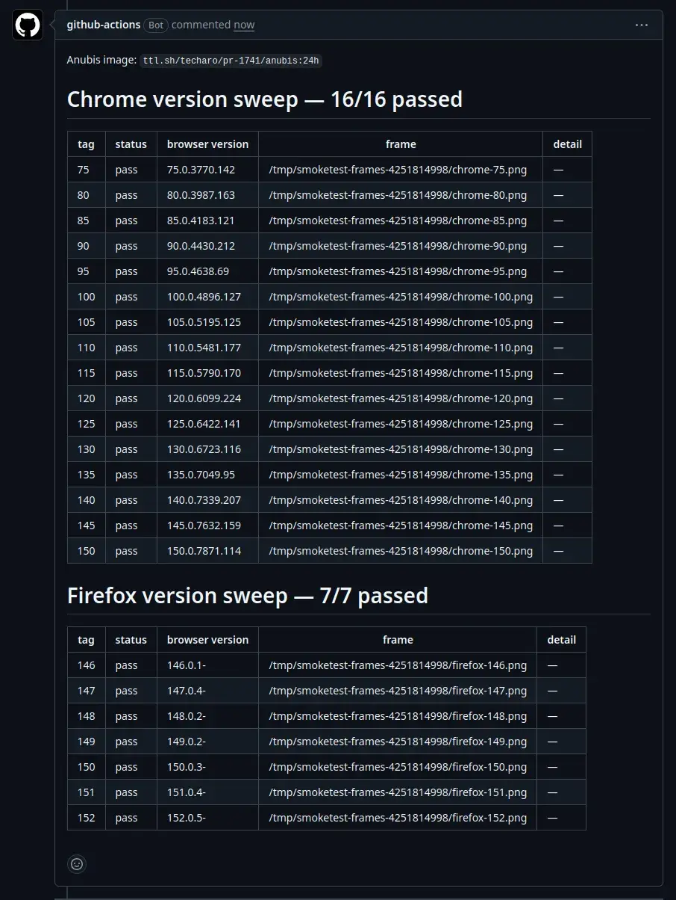

After a year of work, hundreds of commits, 5 generations of pull requests, dozens of tests, rewriting part of Anubis in Rust, the first compiler bug of my career, and at least three times making my tower run out of ram I think I have finally done it. The next version of Anubis will ship with [WebAssembly-based proof of work checks](https://anubis.techaro.lol/docs/admin/configuration/challenges/wasm) that admins can enable in their thresholds or bot rules:

{/* truncate */}

```yaml
thresholds:
  - name: moderate-suspicion
    expression:
      all:
        - weight >= 10
        - weight < 20
    action: CHALLENGE
    challenge:
      algorithm: argon2id
      difficulty: 6
```

This makes Anubis challenges use a [memory-hard](https://en.wikipedia.org/wiki/Memory-hard_function) proof of work function ([argon2id](https://en.wikipedia.org/wiki/Argon2)) instead of just a CPU hard one. It also means that the "hey Claude vibeslop me a CUDA Anubis solver" route is on its way to being fundamentally dead. Overall, this project taught me a lot of things about how WebAssembly works in practice, what the rough edges are when operating on the bleeding edge like I am, and led to the first genuine compiler bug of my career.

Today I want to take you through the journey and process behind adding these WebAssembly based proof of work checks and all the problems that came up along the way.

## Why use WebAssembly in the first place?

The big impetus behind wanting to use WebAssembly in Anubis is that there's a constant tension that's underlined a lot of the performance work I've been doing: phone CPUs suck and trying to balance equitability to phone CPUs with trying to punish scraper CPUs is a huge challenge.

:::note Aside

To be clear: I am tackling the "Anubis makes my phone overheat" problem. It's hard to just lower the difficulty for phones without giving attackers enough information to lower the difficulty for scrapers. If you want to contribute performance data so that I can improve my classification process and/or target future development, please [get in touch with me](https://xeiaso.net/contact/). I want to make things better but can't without data. I am actively testing with a [Moto G8 Power](https://www.gsmarena.com/motorola_moto_g8_power-10052.php) alongside my normal testing steps.

:::

Using WebAssembly here means that the binary will run faster, which will make Anubis _go away_ faster, which is what we all want, right?

### The same binary runs on both the client and the server

One of the other big advantages of this setup is that it lets clients and servers run the same binary in order to solve and validate challenges. Note that I didn't say the same code, I said the same _binary_. This means that the client and server are in lockstep, much like the [CIC chip in the NES](<https://en.wikipedia.org/wiki/CIC_(Nintendo)>). This also does mean that a bug in the shared code means that the client could send an invalid value that the server would accept as valid, but I don't think this is a practical concern until something like that happens.

Right now the [`fast` challenge](https://anubis.techaro.lol/docs/admin/configuration/challenges/proof-of-work) has two implementations in Anubis: one [in JavaScript](https://github.com/TecharoHQ/anubis/blob/main/web/js/worker/sha256.ts) and the other [in Go](https://github.com/TecharoHQ/anubis/blob/main/lib/challenge/proofofwork/proofofwork.go). Updating it in one place means making the same updates in other places and also making sure that everywhere else that assumes how challenges work is also updated.

:::note Aside

Yeah, it's probably bad to have made those assumptions about how challenges work across the codebase. There's a lot of weird technical debt here that needs to be solved at some point. I expect that to be a fair bit of effort to untangle, it may end up with keeping the `fast` challenge only for tests when the WebAssembly based routes are working out well enough to make the default/only option.

:::

Making the same binary run on both the client and the server means that future experiments like per-client program synthesis can also proceed. I'll get more into that sometime in the future.

### This lets us sneak Rust into Anubis

Right now the core of Anubis is written in Go. Go's standard library HTTP server is surprisingly performant and is the key component of things like Google's HTTP frontend service. I have no intention to rewrite Anubis in Rust or anything as drastic as that.

However breaking up Anubis from one monolithic binary into what amounts to a plugin loader is a lot more interesting from a maintenance standpoint. One of the main problems with Anubis is that the combination of rules I've set for myself (no CGo allowed and everything must cross compile to prod from my MacBook) means that updating any part of Anubis means recompiling all of Anubis across prod. Making Anubis be _able_ to have parts of it downloaded and swapped out at runtime is really interesting to me because it means being able to adapt to threats _as soon as the threat actors change behaviour_.

Also I figured out pretty quickly that Rust builds some of the smallest WebAssembly binaries that run hilariously fast, so I wrote all the WebAssembly code in Rust (no-std, wasm32-unknown-unknown)\!

### Finally fixing the challenge difficulty scaling issue

Along the way this also lets me fix one of the bigger administrative problems with Anubis: challenges scale incorrectly with the `fast` challenge. Anubis uses string comparison to count the number of leading zero _nibbles_ in a hash instead of the number of leading zero _bits_. This means that adding one (1) to the difficulty of a challenge makes it 16 (sixteen) times as hard to solve in the worst case.

Here's an interactive diagram to help you understand the difference in scaling at play:

import DiffViz from "./diagrams/DifficultyVisualizer";

<DiffViz />

This was a mistake in retrospect, but if we're changing details about how challenges work here then we may as well wrap up the fix into that.

## How you normally add WebAssembly to something like this

In a normal world you'd not have about half of the restrictions that I have when working with Anubis. Normally you just write your code, compile it to WebAssembly, and then make sure it runs on modern browsers. This is nice and simple. I wish I could live in this world.

Comparatively, this is what it's like getting all of this working across browser versions, platforms, and so many other things:

<center style={{ marginBottom: "1rem" }}></center>

Anubis supports Chrome 75 and newer. I wanted to reduce the support range to not have to deal with Chrome that old (the feature difference between Chrome 155 and Chrome 75 is [absolutely massive](https://caniuse.com/?compare=chrome+75,chrome+155&compareCats=all)), but there are a lot of smartphones, smart TVs, and other electronic devices running Android out there that are just marooned on Chrome that old with _no path to upgrade it_. As a result, I gotta target Chrome 75 for features, but out of an abundance of caution and to make sure that things are generally compatible with browsers older than Chrome 75 (eg: old iOS releases), I target my JavaScript to Chrome 66 as an abundance of caution.

I haven't been able to test with iOS or Android versions of the same vintage as Chrome 75, so a lot of this is aspirational backwards compatibility. I sure hope it's good enough\!

### The host -> guest WASM ABI

When you're doing this kind of work, you're effectively writing an operating system kernel that makes the WebAssembly guests run as processes. Any calls you pass to the WebAssembly guest are effectively system calls into the host. Normally I'd love to be able to reuse the [WebAssembly Component Model](https://component-model.bytecodealliance.org/introduction.html) so that a lot of the "hard part" is done for me. WebAssembly Components make you define your calls in packages that contain interfaces with functions in worlds.

Here's an example of the kind of WebAssembly Interface Types world Anubis would need:

```wit
// theoretical/wit/proof-of-work.wit
package techaro:anubis;

interface update-ui {
  // update the UI with the current nonce every 1024 iterations.
  update-nonce: func(u32);
}

interface proof-of-work {
  // possible ways the computation can go wrong.
  enum error {
    no-error,
    input-too-big,
    cant-find-solution,
    computed-different-result,
  }

  // write up to 4096 bytes of challenge data to the challenge buffer,
  // if the user tries to write more then throw an error.
  write-data: func(data: list<u8>) -> result<u32, error>;

  // read the generated result
  read-result: func() -> list<u8>;

  // write to the verification buffer, if the user tries to write more
  // than the buffer supports throw an error.
  write-verification: func(data: list<u8>) -> error;

  // grind at the right hash in a loop and return the nonce that passes
  // validation to send to the server.
  anubis-work: func(difficulty: u32, initial-nonce: u32, difficulty: u32, iterand: u32) -> result<u32, error>;

  // validate that running the proof of work function on the data buffer
  // with the given nonce results in the same output that the client
  // calculated.
  anubis-validate: func(difficulty: u32, nonce: u32) -> result<bool, error>;
}

world anubis {
  import update-ui;
  export proof-of-work;
}
```

If this worked (I wrote this all out in one go based on how the current handcrafted ABI works and have not tested it, sorry), this would describe the shape of the API that we need for doing the proof of work operations. At the time I wrote the API/ABI that Anubis uses, the main tool for generating the server-side bindings for WebAssembly Component Model stuff in Go [gravity](https://github.com/arcjet/gravity) didn't support passing records (structs) or bytestrings (`list<u8>` or `Vec<u8>` / `[]byte`) from the host to the guest. As such, I had to do it by hand.

### API design

So given that we can't do it the "right way", we have to do it the "bad way". Also given that no matter what I pick for this I'm going to be "wrong", I just decided to treat the WebAssembly modules as dynamic libraries that just happen to use WebAssembly as an implementation detail. There only needs to be three buffers that are read from / written to, so let's just focus around those:

1. The data buffer: up to 4096 bytes of challenge data. This is 4096 bytes so that it can (hopefully) land in its own 4Ki machine page. This is the only variable-length buffer in the setup, so it needs two calls:
   1. `data_ptr() -> *const u8`: return the pointer to the data buffer in WASM linear memory. This is used as the base address for copying data into the guest.
   2. `set_data_length(len: u32)`: update the globally mutable "data length" variable to signal to the guest how much data was actually written into the data buffer. The combination of these two calls lets you treat that global data buffer as a slice.
2. The result buffer: a challenge-defined buffer that usually has about 32 bytes of data. This is read out of the guest's linear memory when the challenge is done processing.
   1. `result_hash_ptr() -> *const u8`: return the pointer to the result buffer in WASM linear memory. This is used as the base address for reading out of the guest.
   2. `result_hash_size() -> usize`: return the length of the result buffer (a compile time constant based on the needs of the challenge, but the runtime can't know that).
3. The verification buffer: a challenge-defined buffer that usually has about 32 bytes of data. This is written into when the server is validating a challenge.
   1. `verification_hash_ptr() -> *const u8`: return the pointer to the result buffer in WASM linear memory. This is used as the base address for reading out of the guest.
   2. `verification_hash_size() -> usize`: return the length of the result buffer (a compile time constant based on the needs of the challenge, but the runtime can't know that).

Challenge modules also expose two entrypoints:

1. `anubis_work`: the main entrypoint for browsers. Given the data loaded into the challenge buffer, hash it in a tight loop until you get a solution that matches the difficulty.
2. `anubis_verify`: the main entrypoint for the server. Given the data loaded into the challenge and verification buffers, ensuring that one run through the hashing function produces a result that both meets the difficulty demands and exactly matches what the client sent.

Challenge modules also import `anubis.anubis_update_nonce` from the environment so that they can periodically report their hash rate back to the frontend. This allows users to see a progress bar based on how long it should take to finish the process.

This works enough for now. It'll be interesting to see how this falls short in the real world\!

## The ride never ends

Honestly, the first bit of this took a few days at most. Most of the hard work was making sure that pointers, offsets, and whatnot were all wired up correctly so that the browser worked the same way as the server. My experience building and messing around with [many](https://github.com/Xe/olin) [WebAssembly](https://github.com/Xe/pahi) [runtimes](https://xeiaso.net/talks/unix-philosophy-logical-extreme-wasm/) and [egregious hacks](https://xeiaso.net/talks/wazero-lightning-2023/) meant that making it was really easy for me.

The devil came out in the details. Here are all the things that came up while I was working on this. All of these problems added up is the sole reason that this took a year instead of a week.

### SIMD means speed in my dispatch

Early on in development I found out that WebAssembly has a [SIMD extension](https://developer.mozilla.org/en-US/docs/WebAssembly/Reference/SIMD). SIMD stands for [Single Instruction Multiple Data](https://en.wikipedia.org/wiki/Single_instruction,_multiple_data) and is a family of instructions that let you do operations on multiple values at a time. This gives programmers data-level parallelism (this is distinct from multi-threading) so that things like hash calculations and MP3 decoding can be done faster than they would be if each operation had to be its own instruction.

[CanIUse considers WebAssembly SIMD to be "baseline"](https://caniuse.com/wasm-simd) (supported by browsers newer than Chrome 91), but I have a lower version bound of Chrome 75\. However the benefits from SIMD on mobile devices are _so drastic_ that it's worth having two builds of the WebAssembly code: one with SIMD and one without it. In the browser it dispatches which version to use by using [wasm-feature-detect](https://www.npmjs.com/package/wasm-feature-detect) to probe WebAssembly functionality by trying to parse/run trivial minimal programs that exercise those features.

Hopefully I don't need to add [an additional build](https://github.com/TecharoHQ/anubis/blob/4578023de7b631537e3a43d89b1998e802beb7e0/web/js/algorithms/wasm.ts#L58-L62) into this process, but there is nothing in the tooling that would prevent it\!

### The birth and death of Yavascript

One of the big things that blocked this shipping for so long was not having an escape hatch of some kind to allow clients that disable WebAssembly by policy to get through the gate. In my experience most clients don't have JavaScript enabled but WebAssembly disabled, however there are a few notable usecases that forced my hand: iOS [Lockdown mode](https://support.apple.com/en-us/105120) and GrapheneOS' [Vanadium](https://discuss.grapheneos.org/d/4196-webassembly-on-vanadium)'s default configuration. This combination of factors means that there would need to be another implementation of the proof of work code in JavaScript that would actually execute the number crunching.

I don't want to make another implementation of the proof of work function (the entire point of this is to only have _one_ implementation\!) so while I was browsing around I came across the legendary talk [The Birth & Death of JavaScript](https://www.destroyallsoftware.com/talks/the-birth-and-death-of-javascript) and got a horrible idea. What if you just compiled the WebAssembly to JavaScript? Would that even work? It's "just" turning one Turing machine into another, right? How would it fare in practice?

Turns out I'm not the first person to think about this\! The team behind [binaryen](https://github.com/WebAssembly/binaryen) have made this escape hatch in the form of [wasm2js](https://github.com/WebAssembly/binaryen/blob/main/src/tools/wasm2js.cpp) which takes WebAssembly binaries and produces moderately cromulent JavaScript in response. One of the main downsides is that the generated binaries tend to be rather large.

For example consider this simple WebAssembly module that exposes a function that adds two numbers together:

```
(module
  (func $add (param $lhs i32) (param $rhs i32) (result i32)
    local.get $lhs
    local.get $rhs
    i32.add)
  (export "add" (func $add))
)
```

Seems simple enough, right? Here's the JavaScript that generates:

```javascript
function asmFunc(imports) {
  var Math_imul = Math.imul;
  var Math_fround = Math.fround;
  var Math_abs = Math.abs;
  var Math_clz32 = Math.clz32;
  var Math_min = Math.min;
  var Math_max = Math.max;
  var Math_floor = Math.floor;
  var Math_ceil = Math.ceil;
  var Math_trunc = Math.trunc;
  var Math_sqrt = Math.sqrt;
  function $0($0_1, $1) {
    $0_1 = $0_1 | 0;
    $1 = $1 | 0;
    return ($0_1 + $1) | 0 | 0;
  }

  return {
    add: $0,
  };
}

var retasmFunc = asmFunc({});
export var add = retasmFunc.add;
```

As you can imagine, this only gets [progressively worse](https://anubis.techaro.lol/.within.website/x/cmd/anubis/static/js/worker/wasm2js.mjs) as you end up making the Rust standard library get compiled from WASM to JavaScript, and even worse when you actually get hashing functions into the mix. The end result is probably very optimized when you run it through a JIT, but given that this runs on an interpreter it's probably gonna be slow no matter what I do.

Sorry\! I tried\!

### How I found the first compiler bug in my career

This ended up working fairly well in testing, but I tried building it in GitHub Actions and ran into an issue. I noticed that wasm2js was [packaged in Ubuntu](https://manpages.ubuntu.com/manpages/resolute/man1/wasm2js.1.html) and that the version in Fedora worked fine but the version in Ubuntu did not and threw an obscure error message about not understanding the tail call extension that Rust was using for some reason.

I ended up bisecting versions of binaryen by downloading a tarball, building it from source, and then seeing if the result of running it on the Anubis WebAssembly modules worked in a browser. I ended up selecting Binaryen version 128, the newest version at the time. It was new enough that most of [the distributions that package Anubis](https://repology.org/project/anubis-anti-crawler/versions) don't have that version of Binaryen packaged.

However I didn't want to make my life more complicated by having some kind of conditional compilation step that would effectively tell end users "sorry, the admin is using an unofficial build that just so happens to not support your browser, please complain to them" because they'll just end up complaining to me. In my experience the kinds of people who run this exact combination of circumstances also tend to be the kind of people that have a wide variance in the level of kindness they display to the authors of open source programs that happen to be in their way. So I needed an escape hatch that would _force_ build systems to use _the exact version_ that I use in my builds.

Then inspiration hit me as if Apollo himself sniped me from the heavens. We're dealing with WebAssembly here right? What's stopping us from just compiling the WebAssembly to JS tool to WebAssembly with some kind of reproducible build, committing that blob to the repo, and then moving on with life?

I ended up [finding a bug in LLVM](https://github.com/llvm/llvm-project/issues/204883) around how it was iterating over exception handling blocks by the compiler iterating over them in machine pointer order. As a result each build would drift by about 29 bytes per build:

```diff
  i32.load  offset=4            ;; 28 02 04
  i32.const 6                   ;; 41 06
  i32.ne                        ;; 47
  br_if     0                   ;; 0d 00
- try_table (catch_all_ref 8)   ;; 1f 40 01 03 08
+ try_table (catch_all_ref 4)   ;; 1f 40 01 03 04
+ try_table (catch_all_ref 9)   ;; 1f 40 01 03 09
    local.get 2                 ;; 20 02
    i32.const 32                ;; 41 20
    i32.add                     ;; 6a
    local.set 3                 ;; 21 03
    local.get 2                 ;; 20 02
    i32.const 56                ;; 41 38
    i32.add                     ;; 6a
    local.get 1                 ;; 20 01
    i32.const 8                 ;; 41 08
    i32.add                     ;; 6a
    call 17461                  ;; 10 b5 88 81 80 00
    local.set 4                 ;; 21 04
  end                           ;; 0b
- try_table (catch_all_ref 4)   ;; 1f 40 01 03 04
    local.get 3                 ;; 20 03
    local.get 4                 ;; 20 04
```

This is what lead me to write [I hate compilers](https://xeiaso.net/notes/2026/anubis-wasm-vendor-binary/) as a combination blogpost/cry for help which made me realize this was actually an LLVM bug. I didn't instantly lean towards it being an LLVM bug until I figured out that disabling ASLR (via `setarch --addr-no-randomize`) made the results consistent on the same host within the same boot.

Honestly this is the first time in my career I've ever run into a compiler bug like this. When I do a lot of my work I usually work under the assumption that the compiler is bug-free and that my inputs are wrong somehow. As such, even thinking it could possibly be an LLVM bug was just outside of the realm of possibility for me.

Once that LLVM bug got fixed and a new version of [wasi-sdk](https://github.com/WebAssembly/wasi-sdk) with that fix got released, I was off to the races, updated my build of wasm-opt/wasm2js, made my build scripts run it with [wasmtime](https://wasmtime.dev/) (alongside a wazero-based fallback process that would be slower, but did work enough) and everything worked out. Every time Anubis builds the WebAssembly in CI it uses the version of wasm-opt and wasm2js that ships in the repo to ensure that everything is as byte-for-byte deterministic as possible.

Your build tools can't differ from my build tools if I ship you the build tools I use.

### Okay, but will it work on Ukrainian Smart TVs?

Then we get into the other big problem that made this difficult: browser testing. One of the most common failure modes of Anubis is that someone uses some browser that I don't test in CI and then things don't work with it. I'm tired of installing 50 different browsers on several machines to test things and I have gone through so many throwaway VMs that I'm sure it's reduced the lifetime of my SSD.

:::note Aside

Yes, I really have been testing Anubis by hand in god knows how many browsers. Why do you think it takes so long to tag new releases?

:::

I built a harness that I call "chromesweep" that lets me spawn many Googles Chrome (term c.f. Attorneys General, et.al) in their default configuration to try and hit a version of Anubis listening over HTTPS. Getting this far meant making a library of all of these browser versions. I've put that library up on Github at [TecharoHQ/gubal](https://github.com/TecharoHQ/gubal) in case it's useful for you.

One of the other big problems I ran into while getting browser testing working was making sure that my Googles Chrome strictly stay within the bounds of my Kubernetes cluster's network. Chrome this old is actively radioactive and I want to treat it like the security threat it is. As such, I set up a strict [NetworkPolicy](https://kubernetes.io/docs/concepts/services-networking/network-policies/) to only allow it to access the Anubis instance under test and make DNS queries. I also wrap each Chrome pod in a microVM with [Kata containers](https://katacontainers.io/) as an additional layer of security.

:::note Aside

It honestly terrifies me to think that I am putting more effort into securing these Googles Chrome than [big AI companies are putting into securing their AI agent testing infrastructure](https://collusion.wiki/). It literally doesn't take much to put a big dent into securing things! The current state of our industry boggles the mind. All I want is for Techaro's [FelonyBench](https://www.felonybench.com/) score to remain at 0, is that too much to ask?

:::

I also rigged the browser testing infrastructure up to a single slash command in GitHub pull requests. Doing it makes my office very warm so I try to avoid doing it when possible. This works well enough that it lets me move on to the next stage and has already caught something that lead to building all the JavaScript with the `--chrome66` flag.



I wonder if this is yet another case where making infrastructure for Anubis could result in that infrastructure alone being its own viable tech product. I run into a lot of those.

### Yo dawg, heard you liked compiling

In the process of doing that automated browser testing I found out that Chrome 75 had a weird error pop up when it tried to compile Anubis' WASM to native code:

```
CompileError: WebAssembly.compile(): Compiling function
#4:\"_RINvMs0_NtNtNtNtCsdl5sGgnNXvY_3std3sys4sync4on...\" failed:
expected table index 0, found 128 @+664
```

This also caused failures up to Chrome 100, so this signaled to me that something I was doing with my "strict MVP" build of Anubis' WASM wasn't in fact sticking to just the MVP features of WebAssembly. It turns out that the function referenced (probably somewhere in [std::sync::Once](https://doc.rust-lang.org/std/sync/struct.Once.html)? I probably should have traced it down to the exact bit) was in the standard library. This surprised me because I assumed that building Rust code with CPU features selected would apply that to everything, including the standard library, right?

No, turns out that when you download the [`rust-std` component](https://rust-lang.github.io/rustup/concepts/components.html) in [rustup](https://rustup.rs/), that doesn't just download the standard library. To aid in cross compilation and I guess to avoid disk space waste, the Rust standard library is precompiled. This surprised me as Go typically has you recompile the standard library (and runtime for that matter) when doing normal builds and cross compilation.

:::note Aside

The actual issue here is that the stdlib function in question was compiled down to use [reference types](https://bytecodealliance.org/articles/reference-types-in-wasmtime), which made [`call_indirect`](https://webassembly.github.io/spec/core/exec/instructions.html#xref-syntax-instructions-syntax-instr-control-mathsf-call-indirect-x-y) references get stored as a table index instead of what MVP WebAssembly would put there. Chrome tried to read a null byte, got not a null byte, and then understandably exploded.

:::

I looked into the process involved for rebuilding the standard library twice: once with only MVP wasm features enabled and once with an "all yes config" like usual. Based on [some research I did](https://wiki.osdev.org/Porting_Rust_standard_library) this seemed like a massive pain.

However, I had gone through that effort to build reproducible WASI versions of wasm2js and wasm-opt. [wasm-opt](https://github.com/WebAssembly/binaryen#tools) is a tool that lets you take compiled WebAssembly modules, optimize them, and more importantly remove features from them so they can run in older browsers. After a bit of hacking to make sure that the tools were able to run properly, I set up a Claude Opus / GLM 5.2 loop to fuzz various wasm-opt flags and make sure Chrome 75 could parse the output. I ended up with these flags:

```shell
# Chrome shipped sign-ext and mutable-globals in 74, bulk-memory and
# nontrapping-fptoint in 75, multivalue in 85 and simd in 91.
baseline_features="-mvp --enable-sign-ext --enable-mutable-globals \
--enable-bulk-memory --enable-nontrapping-float-to-int"
simd128_features="${baseline_features} --enable-multivalue --enable-simd"
```

This strips away all the other WebAssembly features from the build like unwanted paint (the `-mvp` flag means "disable everything not in the original MVP definition of WebAssembly"). I think that it'd be safe-ish to enable reference types in the SIMD build (they were added before Chrome added SIMD), but it's not hurting anything to remove them so I'll just let cowardice win here. Either way, I threw the results into chromesweep and got a successful response, so win\! If/when this comes to bite me I'll try and improve it.

## Things that probably need to be fixed at some point but I want to see what's on fire in practice first, you know?

I'm pretty sure that this work isn't _perfect_, but at some point you gotta cut your losses, ship it, and then see where things fail to prioritize perfecting it. These issues include but are not limited to:

- The wasm2js flow doesn't currently have a way to update the progress bar with its `update_nonce` import stubbed out. I have no idea how to properly wire that up with the constraints of my runtime, but I'm sure I can figure it out eventually.
- The WebAssembly that's shipped with this flow is ridiculously performant. This may mean you need to adjust the difficulty to compensate for this. Oops\! Sorry\!
- This is better on mobile phones, but I'm working on a mobile request classifier that will use a combination of IP address reputation, TLS fingerprinting, and other signals to determine if a request is from a phone and give it the appropriate amount of grace. This is hard. Please contact me if you have ideas on how to make my current prototype better.
- I need some way to dynamically rotate out challenge programs at runtime instead of just at compile time when I work on Anubis. Eventually I hope to have this pull WebAssembly files and supporting bundles from OCI/Docker registries, but I need to do a lot more experimentation with this before I can conclude how good/bad of an idea this is.

Overall though, I'm hopeful that most of the worst parts of this can be solved. It would be nice if I didn't have to work what amounts to two full time jobs.

## Ad astra per aspera

I'm pretty sure that this is stable enough to ship as off-by-default in Anubis v1.28.0: [Wuk Lamat](https://ffxiv.consolegameswiki.com/wiki/Wuk_Lamat). Based on the feedback I get from administrators and users, I'll enable it in the default configuration in Anubis v1.29.0.

I hope this look into how Anubis is developed can give you ideas as to the scale and challenge involved. Making something like this is tireless and thankless work and it's really weird to see people talk about it in the same breath as Cloudflare or AWS' WAF.

Have a good day all!

:::note Aside

AI was not used in the production of the prose of this article. I have my draft as [a Google Doc](https://docs.google.com/document/d/1n-KE0M3gvXXmkWVRy-stT0pWHrz0u0aApaOastqwNEM/edit?tab=t.cknmv81px79i#heading=h.bh5cic8vnftr) so you can see exactly where and when I typed every word myself. The only use of AI was Claude Opus to help me make the visual bit/nibble diagram.

:::
